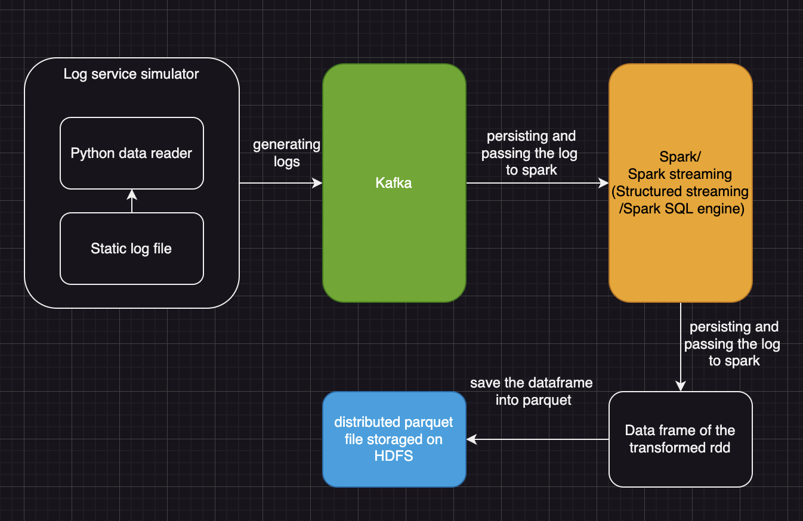
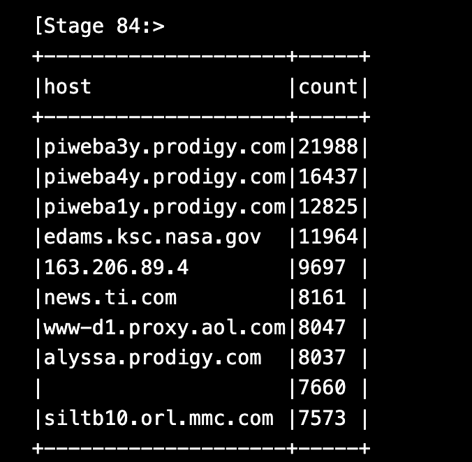
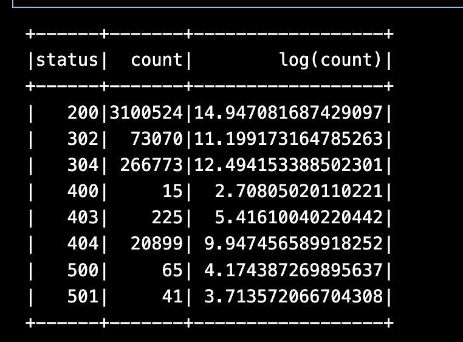

# HDFS-Kafka-Spark-End-to-End-Pipeline

## Project description

This is an log analytics project, that utilized many teck-stacks, including kafka as logging service, PySpark, Spark streaming as the streaming service and distributed analysis, and finally usd HDFS as the distributed output storage system.

We will be working on a log data with size of 2.5 GB, the log entry is in the following format:
```
168.178.113.108 - - [2004-05-18 05:58:48] "GET /Archives/edgar/data/0001439124/000129281422000854/ HTTP/1.0" 500 14101
```

We will produce the data using kafka and consume it into PySpark structured streaming data. Here is the scheme:
``` python
schema = StructType([
    StructField("host", StringType()),
    StructField("timestamp", TimestampType()),
    StructField("request", StringType()),
    StructField("http_response", IntegerType()),
    StructField("bytes_sent", IntegerType())
])
```

### File structure

``` text
├── README.md
├── Section_A_Log_Analytics_Demo.ipynb
├── architecture.png
├── data
├── docker-compose.yml
├── hadoop.env
├── pyspark_service
│   ├── Dockerfile
│   ├── app.py
│   └── requirements.txt
└── python_service
    ├── 40MBFile.log
    ├── Dockerfile
    ├── app.py
    ├── requirements.txt
    └── spark_utils.py
```
### Architecture of the project


1. In the log simulator, we use lazy loading aproach to read the log line by line.
2. We then use the single topic singel thread ingle node to have the simplest case.
3. We consume the data from spark directly using the integration of kafka and the new spark streaming service(Structured Streaming).
4. We can transform the datarame using classic high level Spark SQL api (like what we've done in the `Section_A_Log_Analysis_Demo.ipynb` notebook)
5. We set the default window size on this nalysis to be 20 seconds, and sliding frequency to be 10 seconds, and the windows will be turned from the streaming dataframe in to the HDFS(Hadoop File System) in parquest format.


### Spark analysis rationale
In the Spark analysis section, we will conduct an analysis focus primary on the host, timestamp ,and the http_response fields. Aiming at specific use case as followed:

- Rate limiter service that will block a certain host if they have a reach the threshold of ceiling of request frequency, this can help prevent and lower the damage of the the service abuse, ensuring the server resource won't be exhausted by small group of people.

- Cyber security alert manager, that can detect the surge of certain kind of failed http request, since the high volume of failed http request might be a red flag of service reliabilty or potential cybersecurity issue. For example, high volume of 404 NotFound response code might be indicating a url-bustering attack from a hacker is happening.

The way we achieved this functionality is to have a sliding window counter that will keep tracking on the number of request, using `count` as aggregation function and group by host name for the rate limiter service, and group by `http_response`


## Run

First get the static log file in the local system.

```
mv /path/to/the/log ./python_service
```

update the name of the log file

``` python
# ./python_servie/app.py
LOG_FILE = NAME_OF_THE_LOG_FILE
```

Then run the docker-compose

```
docker-compose up --build
```

## Simple Ourput

### top ten frenquent host

### top ten status count


### top ten log status count


### top ten log status count


